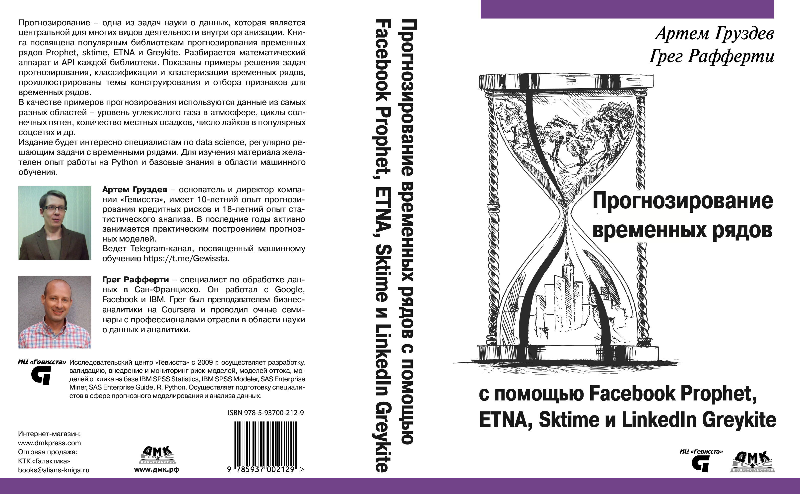

# Программный код к книге "Прогнозирование временных рядов с помощью Facebook Prophet, ETNA, Sktime и LinkedIn Greykite"

Этот репозиторий содержит программный код к книге "Прогнозирование временных рядов с помощью Facebook Prophet, ETNA, Sktime и LinkedIn Greykite" [Артема Груздева](https://t.me/Gewissta) и Грега Рафферти.
Книга является коллекцией избранных материалов из томов 3 и 4 [Подписки "Прикладной анализ временных рядов"](https://boosty.to/gewissta/purchase/2250743?ssource=DIRECT&share=subscription_link) – обновляемых в режиме реального времени материалов по применению методов классического и глубокого машинного обучения в различных промышленных задачах, которые автор делает вместе с коллегами и учениками.
Детальную информацию о книге вы можете найти на веб-сайте издательства "ДМК-Пресс" (https://dmkpress.com/catalog/computer/data/978-5-93700-212-9/).

Книга требует библиотеки: 
- ETNA версий 2.0 или 2.1; 
- Sktime версии 0.25;
- Prophet версии 1.0;
- Greykite 0.5.0.

## Опечатки
Всю информацию по опечаткам отправляйте на [электронную почту](mailto:info@gewissta.ru). Если есть проблемы с кодом, пользуйтесь кнопкой [New Issue](https://github.com/Gewissta/Prophet_ETNA_Book/issues/new/choose) раздела Issues.

## Список найденных опечаток:

## Список исправлений программного кода:

